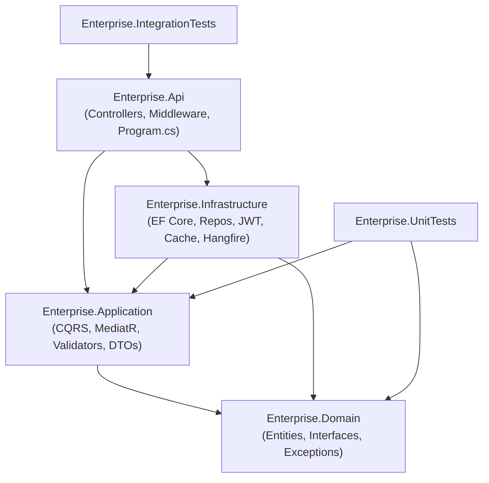

# Architecture

This document explains **why** this template is built the way it is, folder by folder and
decision by decision. It intentionally does not just restate the code — the code already does
that. If you're evaluating whether a pattern here is "over-engineering" or "exactly enough",
this is the place that argument is made explicitly.

## Table of contents

- [Solution layout](#solution-layout)
- [The dependency rule](#the-dependency-rule)
- [Domain layer](#domain-layer)
- [Application layer](#application-layer)
- [Infrastructure layer](#infrastructure-layer)
- [Api layer](#api-layer)
- [Cross-cutting decisions explained](#cross-cutting-decisions-explained)
- [Deliberately rejected alternatives](#deliberately-rejected-alternatives)
- [Testing strategy](#testing-strategy)

## Solution layout



```text
Enterprise.slnx
├── src/
│   ├── Enterprise.Domain/          Zero project references. Pure C#, no framework dependency.
│   │   ├── Common/                 BaseEntity, BaseAuditableEntity, ISoftDelete
│   │   ├── Entities/                Product, User, Role, Permission, RolePermission, UserRole, RefreshToken, ApiKey
│   │   ├── Enums/
│   │   ├── Exceptions/              True invariant violations (e.g. InsufficientStockException)
│   │   ├── Specifications/          ISpecification<T>, BaseSpecification<T>
│   │   └── Interfaces/              IRepository<T>, IUnitOfWork, entity-specific repository interfaces
│   │
│   ├── Enterprise.Application/      Depends only on Domain.
│   │   ├── Common/Behaviors/        ValidationBehavior, LoggingBehavior, UnhandledExceptionBehavior, CachingBehavior, CacheInvalidationBehavior
│   │   ├── Common/Interfaces/       ITokenService, ICurrentUserService, ICacheService, IBackgroundJobService, IDateTime, IPasswordHasher
│   │   ├── Common/Models/           PagedResult<T>, PaginationParams
│   │   ├── Common/Exceptions/       NotFoundException, ValidationException, ConflictException, ForbiddenAccessException, AuthenticationFailedException
│   │   ├── Common/Mappings/         Mapster IRegister config
│   │   ├── Features/Admin/          Admin roles, users, services CQRS modules
│   │   ├── Features/Provider/       Provider roles, staff CQRS modules
│   │   └── Features/Providers/      Admin provider management CQRS
│   │
│   ├── Enterprise.Infrastructure/   Depends on Application + Domain (implements their interfaces).
│   │   ├── Persistence/             ApplicationDbContext, Configurations, Interceptors, Repositories, Seed, Migrations
│   │   ├── Identity/                JwtTokenService, PasswordHasher, CurrentUserService, ApiKeyAuth/*
│   │   ├── Caching/                 RedisCacheService, InMemoryCacheService
│   │   ├── BackgroundJobs/          HangfireBackgroundJobService, Jobs/PurgeExpiredRefreshTokensJob
│   │   └── DependencyInjection.cs
│   │
│   └── Enterprise.Api/              Composition root.
│       ├── Controllers/V1/          Admin/*, Provider/*, Client auth & profile controllers
│       ├── Middleware/              GlobalExceptionHandler, SecurityHeadersMiddleware, CorrelationIdMiddleware
│       ├── Authorization/           PermissionRequirement, PermissionAuthorizationHandler, PermissionPolicyProvider, RequirePermissionAttribute
│       ├── Extensions/              SwaggerServiceExtensions, VersioningServiceExtensions, RateLimitingExtensions, HangfireDashboardAuthorizationFilter
│       ├── Program.cs
│       └── appsettings*.json
│
└── tests/
    ├── Enterprise.UnitTests/        NUnit + Moq + FluentAssertions — domain, validator and handler tests
    └── Enterprise.IntegrationTests/ WebApplicationFactory<Program> + SQLite in-memory — full HTTP round-trip tests
```

## The dependency rule

`Domain` has **zero** project references — no EF Core, no ASP.NET Core, not even MediatR. This
is what makes it "the domain": every other project depends on it, it depends on nothing. If you
ever find yourself wanting to `using Microsoft.EntityFrameworkCore` inside `Enterprise.Domain`,
that's a signal the abstraction belongs in `Infrastructure` instead (this happened once during
this template's own build — see [`SpecificationEvaluator`](#specification-pattern) below).

`Application` depends only on `Domain`. It defines interfaces (`ITokenService`,
`ICacheService`, `IPasswordHasher`, `IBackgroundJobService`) that describe *what* the system
needs from the outside world, without knowing *how* those needs get fulfilled. This is what
lets `Enterprise.UnitTests` mock every external concern with plain Moq — no EF Core, no Redis,
no real JWT library, ever touches a unit test.

`Infrastructure` depends on `Application` + `Domain` and implements those interfaces with real
technology (EF Core/SQL Server, `System.IdentityModel.Tokens.Jwt`, StackExchange.Redis,
Hangfire). `Application` handlers never reference any of this directly.

`Api` is the composition root. Each layer exposes exactly one `Add<Layer>()` extension method
(`AddApplication()`, `AddInfrastructure(configuration)`), so `Program.cs` stays a thin
orchestrator that composes layers instead of knowing what packages they use internally.

## Domain layer

### Entities model behaviour, not just data

`Product` has no public setters for `StockQuantity` or `Status` — only intention-revealing
methods (`DecreaseStock`, `IncreaseStock`, `Discontinue`) that enforce invariants (stock can
never go negative — `InsufficientStockException` is thrown instead). This is the difference
between an anemic domain model (a bag of properties a service class mutates) and one where
"can this state exist?" is answered by the compiler and the constructor/methods, not by
scattered validation in every caller.

The same is true of `User` (`RegisterFailedLogin`/`ResetFailedLoginCount` encapsulate the
lockout policy instead of leaving `AccessFailedCount++` scattered in a handler) and
`RefreshToken` (`Revoke(...)` is the only way to transition a token's state — you cannot set
`RevokedAtUtc` from outside).

### Specification pattern

`ISpecification<T>` / `BaseSpecification<T>` encapsulate a query's criteria, includes, ordering
and paging as a single object, so `GenericRepository<T>` stays generic instead of growing a
bespoke method per feature (e.g. many one-off query methods multiplying combinatorially).
`MarketplaceServiceFilterSpecification` is one concrete example, covering search/filter/paging
for the admin services list endpoint in a single class.

`SpecificationEvaluator` (which turns an `ISpecification<T>` into an EF Core `IQueryable<T>` via
`.Where()`/`.Include()`/`.OrderBy()`) lives in **Infrastructure**, not Domain, even though the
specifications themselves live in Domain. It was actually built in Domain first during this
template's construction and then deliberately moved — it needs EF Core's `.Include()` method,
which is an Infrastructure concern. The specification *contract* (what to filter/sort/page by)
is domain knowledge; the specification *evaluator* (how to turn that into a LINQ provider's
query) is not. This split is the reason `ISpecification<T>` doesn't have an
`Apply(IQueryable<T>)` method on it directly.

### Repository/UnitOfWork on top of EF Core, even though `DbContext` already is a Unit of Work

This is a deliberate, debatable choice, not cargo-culted boilerplate:

- It gives the Specification pattern above a single seam to be applied through.
- It centralizes the soft-delete/audit convention application-wide instead of leaving it to
  every handler to remember.
- It keeps `Application` handlers persistence-ignorant — they depend on `Domain` interfaces
  (`IMarketplaceServiceRepository`, `IUnitOfWork`), never on `DbContext` or `DbSet<T>` — which is what
  makes handler unit tests possible without a database at all.

The tradeoff is acknowledged: some teams skip this layer and inject `DbContext` straight into
handlers. Here, it earns its keep specifically because of the Specification pattern requirement
and the desire for handler-level unit testability without EF Core in the test project.

## Application layer

### CQRS via MediatR *is* the use-case layer — not a parallel service layer

Every command/query handler under `Features/*` IS the application's use-case/service layer.
There is deliberately no separate `ProductService.CreateAsync(...)` sitting next to
`CreateProductCommandHandler.Handle(...)` doing the same job — that duplication (a very common
anti-pattern) is exactly what CQRS+MediatR is meant to replace, not sit alongside.

"Services" that *do* exist (`ITokenService`, `ICurrentUserService`, `ICacheService`,
`IBackgroundJobService`) are reserved for genuinely singular-responsibility technical concerns
that handlers *consume* — they are not use-case orchestrators themselves.

### MediatR pipeline behaviors — the actual payoff of using MediatR

Registered in this exact order in `Enterprise.Application.DependencyInjection` (behaviors wrap
the handler in registration order, outermost first):

1. **`UnhandledExceptionBehavior`** — logs any exception that isn't one of the application's own
   typed exceptions, then rethrows, so the global exception handler still produces the correct
   response while nothing gets silently swallowed.
2. **`LoggingBehavior`** — logs request start/end and flags any handler taking longer than 500ms,
   without a single handler needing a `Stopwatch`.
3. **`ValidationBehavior`** — runs every registered FluentValidation `IValidator<TRequest>`
   before the handler executes. By the time `Handle()` runs, the request is already known-valid;
   handlers never contain a defensive `if (string.IsNullOrEmpty(...))` block.
4. **`CachingBehavior`** — short-circuits the handler entirely for any query implementing the
   `ICacheableQuery` marker interface, if a cached value exists.
5. **`CacheInvalidationBehavior`** — after a command implementing `ICacheInvalidatorCommand`
   succeeds, removes every cache-key prefix it declares.

This means caching is **declarative** (`GetProductByIdQuery : ICacheableQuery` +
`CreateProductCommand : ICacheInvalidatorCommand { CacheKeyPrefixesToInvalidate => [...] }`)
instead of `_cache.Get(...)`/`_cache.Set(...)` calls scattered inside every handler that happens
to need caching.

### No `Result<T>`/`ErrorOr` alongside exceptions

Deliberately not introduced. Mixing two competing error-handling paradigms (custom exceptions
*and* a Result monad) in one template creates ambiguity about which one a new handler should
use. Since the brief explicitly calls for custom exceptions + global middleware,
the template commits fully to that single mechanism: `NotFoundException`, `ConflictException`,
`AuthenticationFailedException`, `ForbiddenAccessException`, `EmailDeliveryException`, and
`ValidationException` (raised only by `ValidationBehavior`), all mapped by exactly one place —
[`GlobalExceptionHandler`](#global-exception-handling).

### Unified `ApiResponse<T>` envelope

Every success and error body uses the same shape so frontends can deserialize one contract:

```json
{
  "success": true,
  "statusCode": 200,
  "message": "…",
  "errors": [],
  "data": { },
  "traceId": "…"
}
```

- Defined in `Enterprise.Api/Models/ApiResponse.cs` (presentation concern).
- Controllers return it via `OkResponse` / `CreatedResponse` / `EmptyResponse` on `ApiControllerBase`.
- `GlobalExceptionHandler` returns the same envelope with `success: false` (HTTP status still set correctly).
- List endpoints keep `PagedResult<T>` **inside** `data` (paging metadata stays part of the payload).
- Former `204 NoContent` actions return `200` with `data: null` so the envelope is always present.

## Infrastructure layer

### Soft delete

`ISoftDelete` (`IsDeleted`, `DeletedAtUtc`, `DeletedBy`) is implemented by `Product` and `User`.
`ApplicationDbContext.OnModelCreating` applies a **global query filter**
(`ModelBuilderExtensions.AddSoftDeleteQueryFilter`) to every entity implementing it, so a
soft-deleted row is invisible to every query anywhere in the codebase — including one written
months from now by someone who has never heard of this convention. Relying on
`.Where(x => !x.IsDeleted)` sprinkled through every query is exactly the kind of easy-to-forget
discipline a global filter exists to remove.

`AuditableEntitySaveChangesInterceptor` rewrites an `EntityState.Deleted` entry implementing
`ISoftDelete` into `EntityState.Modified` (setting `IsDeleted = true` instead), and also
auto-populates `CreatedAtUtc`/`CreatedBy`/`LastModifiedAtUtc`/`LastModifiedBy` on every save —
so `DeleteProductCommandHandler` calls `unitOfWork.Products.Remove(product)` exactly as if it
were a hard delete, and the interceptor transparently makes it a soft one.

### Two caching backends behind one interface

`ICacheService` has two implementations, chosen at startup based on whether
`ConnectionStrings:Redis` is configured:

- **`RedisCacheService`** — talks to `IConnectionMultiplexer` directly rather than through
  `IDistributedCache`, because `RemoveByPrefixAsync` needs Redis's `SCAN`/`KEYS` capability via
  `IServer.Keys(pattern:)`, which `IDistributedCache` deliberately doesn't expose (not every
  distributed cache backend supports pattern scanning).
- **`InMemoryCacheService`** — wraps `IMemoryCache` with a side `ConcurrentDictionary<string,
  byte>` tracking every key ever set under a given prefix, since `IMemoryCache` has no native
  prefix-removal or enumeration API at all.

A single-instance deployment works fine on the in-memory fallback; a multi-instance deployment
**must** configure `ConnectionStrings:Redis` so every instance shares one cache and sees the
same invalidations — documented here explicitly rather than only in a code comment.

### Authentication = native ASP.NET Core multi-scheme auth, not a hand-rolled `IAuthenticationStrategy`

ASP.NET Core's `AuthenticationHandler<TOptions>`/scheme system already *is* the Strategy Pattern
for authentication providers: `AddJwtBearer(...)` registers one handler, a custom
`ApiKeyAuthenticationHandler` (reading `X-Api-Key`, hashing it, looking it up via
`IApiKeyRepository`) registers a second, and the default authorization policy accepts either
scheme:

```csharp
services.AddAuthorizationBuilder()
    .SetDefaultPolicy(new AuthorizationPolicyBuilder(
            JwtBearerDefaults.AuthenticationScheme, ApiKeyAuthenticationDefaults.SchemeName)
        .RequireAuthenticatedUser()
        .Build());
```

Building a redundant custom `IAuthenticationStrategy` abstraction on top of a framework
abstraction that already solves this exact problem would violate "avoid unnecessary
abstractions" — it would just be re-describing the Strategy Pattern the framework already
implements, with no added flexibility.

### API keys are hashed exactly like passwords

`ApiKey.KeyHash` stores a SHA-256 hash; the raw key (`ek_live_<prefix>.<secret>`) is returned to
the caller **exactly once**, at generation time, and never persisted or retrievable again — a
leaked database row is not itself a usable credential, mirroring password-hashing discipline.

### Refresh token rotation and reuse detection

Implemented in `RefreshTokenCommandHandler`:

1. Every successful refresh **revokes** the presented token (`Revoke(ip, reason,
   replacedByTokenHash)`) and issues a brand-new one — the old token can never be used again.
2. If a token that is **already revoked** is presented again, that is treated as a strong signal
   of theft (the legitimate client *and* an attacker both had a copy) — instead of just
   rejecting it, **every other active refresh token for that user** is revoked too, forcing a
   full re-login on every device.

## Api layer

### Global exception handling

`GlobalExceptionHandler` implements .NET 8's `IExceptionHandler` — the modern replacement for a
hand-rolled try/catch middleware — registered via `AddExceptionHandler<GlobalExceptionHandler>()`
+ `UseExceptionHandler()`. It is the **one** place in the entire codebase that turns an exception
into an HTTP status code, mapping:

| Exception | Status | 
|---|---|
| `Enterprise.Application.Common.Exceptions.ValidationException` | 400 (`errors` flattened from per-field messages) |
| `NotFoundException` | 404 |
| `ConflictException` | 409 |
| `AuthenticationFailedException` | 401 |
| `ForbiddenAccessException` | 403 |
| `EmailDeliveryException` | 503 |
| `Enterprise.Domain.Exceptions.DomainException` (e.g. `InsufficientStockException`) | 409 |
| anything else | 500 (logged; message never leaked to clients) |

Every error body uses the same `ApiResponse<object?>` envelope as successes (`success: false`),
including `message`, `errors`, `statusCode`, and `traceId` for log correlation.

### Permission-based authorization via a dynamic policy provider

`[RequirePermission("Products.Create")]` is sugar for
`[Authorize(Policy = "Permission:Products.Create")]`. `PermissionPolicyProvider` (a custom
`IAuthorizationPolicyProvider`) recognizes the `Permission:` prefix and synthesizes a policy
containing a `PermissionRequirement` on the fly — for everything else it falls back to
ASP.NET Core's `DefaultAuthorizationPolicyProvider`. `PermissionAuthorizationHandler` then checks
a `permission` claim (flattened onto the JWT/API-key principal from the user's roles at
token-issuance time — see `JwtTokenService.GenerateAccessToken`), not role membership directly.

Without this, every new permission string would need a matching
`options.AddPolicy("Products.Create", ...)` registered by hand in `Program.cs` — a second source
of truth guaranteed to drift as the permission list grows. Reassigning a permission between
roles in the seed data changes what a user can do on their *next login*, with zero code changes
anywhere in the Api layer.

### Security headers, correlation IDs, rate limiting

- `SecurityHeadersMiddleware` — see [SECURITY.md](SECURITY.md) for the full header-by-header
  rationale.
- `CorrelationIdMiddleware` — accepts an inbound `X-Correlation-Id` or generates one, echoes it
  on the response, and pushes it into Serilog's `LogContext` so every log line for a request
  (including ones written deep inside a MediatR handler) carries the same id without that
  handler ever referencing `HttpContext`.
- `RateLimitingExtensions` — ASP.NET Core's built-in rate limiter (no third-party package needed
  since .NET 7), with a generous global per-IP policy (100 req/min) and a much stricter policy
  applied only to `/api/v{version}/auth/*` (5 req/min) — the endpoints an attacker actually wants
  to brute-force get their own tight budget instead of sharing one with read-heavy product
  browsing.

### API versioning + per-version Swagger

`VersioningServiceExtensions` configures URL-segment versioning (`/api/v1/...`).
`ConfigureSwaggerOptions` (an `IConfigureOptions<SwaggerGenOptions>`) generates one Swagger
document *per* discovered `ApiVersion` automatically via `IApiVersionDescriptionProvider`, so
adding a `v2` controller later produces a `v2` Swagger document without touching
`Program.cs`.

### Hangfire dashboard

`/hangfire` is a browser UI, not a JSON endpoint — it can't be gated by the JWT/API-key bearer
schemes the rest of the API uses, since a browser navigating there doesn't attach an
`Authorization` header. `HangfireDashboardAuthorizationFilter` restricts it to loopback requests
as a baseline; a real deployment should put it behind a VPN/reverse-proxy IP allowlist instead
(documented in [SECURITY.md](SECURITY.md)).

## Cross-cutting decisions explained

### Migrations auto-apply in Development only

`Program.cs` only calls `DbSeeder.SeedAsync` (which itself calls `Database.MigrateAsync`) when
`app.Environment.IsDevelopment()`. Production applies migrations through a controlled CI/CD step
(`dotnet ef database update` against the target connection string as part of a deployment
pipeline), never automatically on every instance's startup — auto-migrating on boot risks
concurrent instances racing to apply the same migration, or an accidental destructive schema
change going out silently with a routine deploy.

### Object mapping via Mapster, one-way only

Entity → DTO mapping uses Mapster (compile-time-friendly, near-zero-allocation, no runtime
profile-resolution magic like AutoMapper). There is **no** DTO → entity mapping anywhere in this
template: entities have private setters and are mutated only through their own methods
(`Product.UpdateDetails(...)`, `AssignRole(...)`, etc.), so a reflection-based "map this DTO onto
that entity" would either fail outright (no public setters to hit) or, if forced via field
access, silently bypass every invariant the entity exists to protect.

## Deliberately rejected alternatives

- **A full `AddIdentity()` membership system** — brings `UserManager`/`SignInManager`, email
  confirmation flows, external login provider tables, and a lot of machinery this template
  doesn't need, while obscuring exactly how JWT issuance, permission resolution and API keys
  work — which is precisely what a reference template should make explicit. Only
  `Microsoft.AspNetCore.Identity.PasswordHasher<T>` is reused (proven PBKDF2-HMAC-SHA256,
  salted, adaptive iteration count) — the one component worth not reinventing.
- **Anti-forgery tokens for CSRF** — see [SECURITY.md](SECURITY.md#csrf) for the full reasoning;
  summary: this is a stateless Bearer-token API, not cookie-session auth, so classic CSRF does
  not apply the same way, and cargo-culting anti-forgery middleware onto a token API would be
  security theater, not a mitigation.
- **`Result<T>`/`ErrorOr` alongside exceptions** — see
  [above](#no-resulttrerroror-alongside-exceptions).

## Testing strategy

- **`Enterprise.UnitTests`** (NUnit + Moq + FluentAssertions) — three layers of coverage:
  - `Domain/*` — entity invariants exercised with zero mocks at all (`Product.DecreaseStock`
    throwing `InsufficientStockException`, `User` lockout policy, `RefreshToken`/`ApiKey` state
    transitions).
  - `Validators/*` — FluentValidation rules via `TestValidate`, independent of any handler.
  - `Handlers/*` — MediatR command/query handlers with `IUnitOfWork` and friends mocked via
    Moq, verifying both the happy path and every thrown exception branch.
- **`Enterprise.IntegrationTests`** (`WebApplicationFactory<Program>` + SQLite in-memory) — real
  HTTP round-trips through the *actual* middleware pipeline, authentication schemes, and
  authorization policies, against a real (if disposable) relational database. `Program`'s own
  Development-only migrate-and-seed path runs unmodified, so these tests exercise the same code
  path production Development environments do. See
  [`CustomWebApplicationFactory`](tests/Enterprise.IntegrationTests/CustomWebApplicationFactory.cs)
  for exactly what is substituted (SQL Server → SQLite, Hangfire SQL Server storage →
  `Hangfire.InMemory`) and why.

  This suite is what caught the `WriteAsJsonAsync` bug documented above — a category of bug that,
  by construction, no mocked unit test could ever surface.
