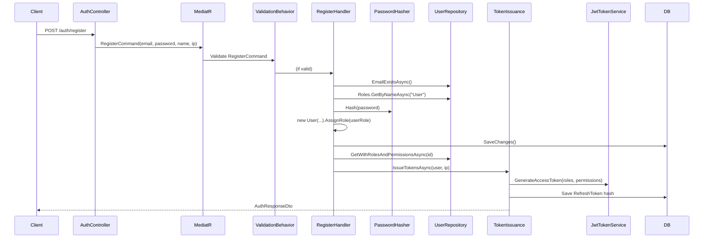
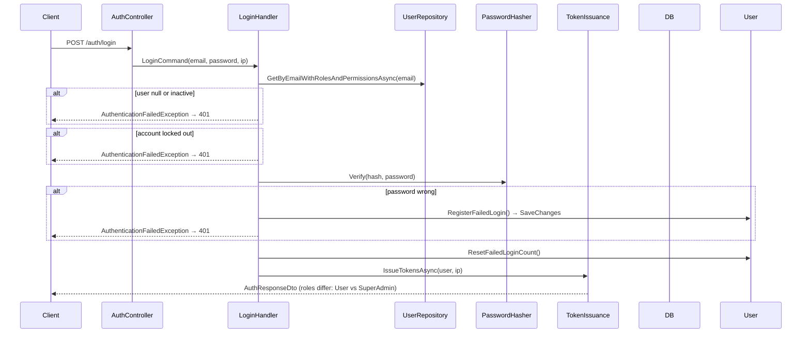
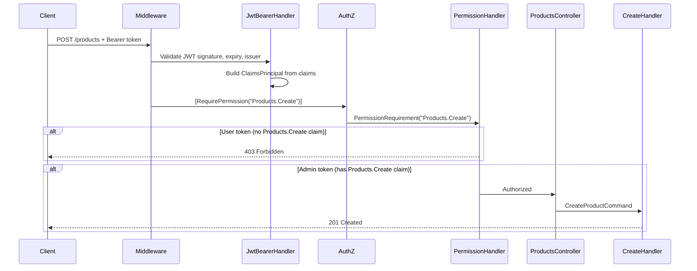

# Authentication Code Workflow

**Project:** Enterprise Clean Architecture API  
**Audience:** Backend developers on the team  
**Purpose:** Trace how auth code flows through layers — for both **User** and **Admin**  
**Companion docs:** [AUTH_FLOW.md](./AUTH_FLOW.md) (API usage) · [AUTH_STEP_BY_STEP.md](./AUTH_STEP_BY_STEP.md) (hands-on guide)

---

## Table of Contents

1. [Key Concept: User and Admin Share the Same Code](#key-concept-user-and-admin-share-the-same-code)
2. [Layer Map](#layer-map)
3. [Startup & Dependency Injection](#startup--dependency-injection)
4. [Code Flow: Registration (User only)](#code-flow-registration-user-only)
5. [Code Flow: Login (User & Admin)](#code-flow-login-user--admin)
6. [Code Flow: Token Issuance (shared)](#code-flow-token-issuance-shared)
7. [Code Flow: Protected Request (User vs Admin)](#code-flow-protected-request-user-vs-admin)
8. [Code Flow: Refresh Token](#code-flow-refresh-token)
9. [Code Flow: API Key (Admin)](#code-flow-api-key-admin)
10. [MediatR Pipeline (all commands)](#mediatr-pipeline-all-commands)
11. [Exception → HTTP Status Mapping](#exception--http-status-mapping)
12. [Database Model (roles → permissions)](#database-model-roles--permissions)
13. [File Reference by Flow](#file-reference-by-flow)

---

## Key Concept: User and Admin Share the Same Code

There is **no separate admin login handler**, **no Admin entity**, and **no admin-specific controller** for authentication.

| Concern | User | Admin |
|---|---|---|
| Login handler | `LoginCommandHandler` | **Same** `LoginCommandHandler` |
| Token issuance | `TokenIssuanceService` | **Same** `TokenIssuanceService` |
| JWT generation | `JwtTokenService` | **Same** `JwtTokenService` |
| Authorization check | `PermissionAuthorizationHandler` | **Same** handler |
| What differs | Role = `User` in DB | Role = `SuperAdmin` in DB (seeded) |
| Permissions in JWT | `Products.Read` only | All permissions |

The only place admin differs from user at **code** level:
1. **Registration** assigns `User` role — admin is never created via register
2. **DbSeeder** creates admin with `SuperAdmin` role at startup
3. **Permission claims** embedded in JWT differ based on DB role assignments

---

## Layer Map

```
┌─────────────────────────────────────────────────────────────────┐
│  Enterprise.Api                                                  │
│  AuthController, ProductsController, RequirePermissionAttribute  │
│  PermissionPolicyProvider, PermissionAuthorizationHandler        │
│  Program.cs (middleware pipeline)                                │
└────────────────────────────┬────────────────────────────────────┘
                             │ MediatR ISender
┌────────────────────────────▼────────────────────────────────────┐
│  Enterprise.Application                                          │
│  LoginCommandHandler, RegisterCommandHandler, TokenIssuanceService│
│  Validators, Pipeline Behaviors (Validation, Logging, etc.)      │
└────────────────────────────┬────────────────────────────────────┘
                             │ IUnitOfWork, IPasswordHasher, ITokenService
┌────────────────────────────▼────────────────────────────────────┐
│  Enterprise.Infrastructure                                       │
│  JwtTokenService, PasswordHasher, CurrentUserService             │
│  ApiKeyAuthenticationHandler, UserRepository, ApplicationDbContext│
│  DbSeeder                                                        │
└────────────────────────────┬────────────────────────────────────┘
                             │
┌────────────────────────────▼────────────────────────────────────┐
│  Enterprise.Domain                                               │
│  User, Role, Permission, UserRole, RolePermission, RefreshToken  │
└─────────────────────────────────────────────────────────────────┘
```

**Dependency rule:** Api → Application + Infrastructure → Domain. Domain has zero framework references.

---

## Startup & Dependency Injection

### `Program.cs` — composition root

```csharp
builder.Services.AddApplication();           // MediatR, validators, TokenIssuanceService
builder.Services.AddInfrastructure(config); // JWT, EF Core, PasswordHasher, repositories

// Overrides default auth policy provider
builder.Services.AddSingleton<IAuthorizationPolicyProvider, PermissionPolicyProvider>();
builder.Services.AddSingleton<IAuthorizationHandler, PermissionAuthorizationHandler>();

// Middleware order (auth-relevant):
app.UseAuthentication();   // JwtBearerHandler + ApiKeyAuthenticationHandler
app.UseAuthorization();    // PermissionAuthorizationHandler
app.MapControllers();
```

### `AddApplication()` — `Enterprise.Application/DependencyInjection.cs`

Registers:
- **MediatR** handlers from assembly (including all auth command handlers)
- **Pipeline behaviors** (order matters, outermost first):
  1. `UnhandledExceptionBehavior`
  2. `LoggingBehavior`
  3. `ValidationBehavior` ← runs FluentValidation before handler
  4. `CachingBehavior`
  5. `CacheInvalidationBehavior`
- **FluentValidation** validators (e.g. `RegisterCommandValidator`, `LoginCommandValidator`)
- **`ITokenIssuanceService` → `TokenIssuanceService`**

### `AddInfrastructure()` — `Enterprise.Infrastructure/DependencyInjection.cs`

Registers:
- **`IPasswordHasher` → `PasswordHasher`** (wraps ASP.NET Identity PBKDF2)
- **`ITokenService` → `JwtTokenService`** (JWT sign + refresh token generate/hash)
- **`ICurrentUserService` → `CurrentUserService`** (reads claims from HttpContext)
- **`IUnitOfWork` → `UnitOfWork`** (includes `Users`, `Roles`, `RefreshTokens`, `ApiKeys` repos)
- **JWT Bearer** authentication scheme with `TokenValidationParameters`
- **API Key** custom scheme → `ApiKeyAuthenticationHandler`
- **Default authorization policy:** authenticated user via JWT **or** API key

### Development seeding — `Program.cs` + `DbSeeder.cs`

On startup in Development only:
```
DbSeeder.SeedAsync()
  → SeedPermissionsAsync()     // Products.Read, Products.Create, etc.
  → SeedRolesAsync()           // User, Admin, SuperAdmin + permission links
  → SeedAdminUserAsync()       // admin@enterprise.local + SuperAdmin role
  → SeedSampleProductsAsync()
```

---

## Code Flow: Registration (User only)

Admin accounts are **not** created through this flow.



### Step-by-step (file → method)

| Step | File | What happens |
|---|---|---|
| 1 | `AuthController.cs` | `[AllowAnonymous]` — binds body to `RegisterRequest`, creates `RegisterCommand`, calls `Mediator.Send()` |
| 2 | `ValidationBehavior.cs` | Runs `RegisterCommandValidator` (email format, password strength) |
| 3 | `RegisterCommandHandler.cs` | `EmailExistsAsync()` → throw `ConflictException` if duplicate |
| 4 | `RegisterCommandHandler.cs` | `Roles.GetByNameAsync("User")` — loads default role from DB |
| 5 | `PasswordHasher.cs` | `Hash(password)` → PBKDF2 hash string |
| 6 | `User.cs` (Domain) | `new User(email, hash, firstName, lastName)` + `AssignRole(defaultRole)` |
| 7 | `UserRepository.cs` | `Add(user)` via UnitOfWork → `SaveChangesAsync()` |
| 8 | `UserRepository.cs` | `GetWithRolesAndPermissionsAsync(id)` — reload with `.Include()` chain |
| 9 | `TokenIssuanceService.cs` | See [Token Issuance flow](#code-flow-token-issuance-shared) |

### Domain entity involvement

```csharp
// User.cs — role assignment at registration
user.AssignRole(defaultRole);
// Creates UserRole join record linking User.Id ↔ Role.Id
```

---

## Code Flow: Login (User & Admin)

**Same code path.** Admin is just a `User` row with `SuperAdmin` role in the database.



### Step-by-step (file → method)

| Step | File | What happens |
|---|---|---|
| 1 | `AuthController.cs` | `[AllowAnonymous]`, creates `LoginCommand`, `Mediator.Send()` |
| 2 | `ValidationBehavior.cs` | Runs `LoginCommandValidator` |
| 3 | `LoginCommandHandler.cs` | `GetByEmailWithRolesAndPermissionsAsync(email)` |
| 4 | `UserRepository.cs` | EF query with `.Include(UserRoles → Role → RolePermissions → Permission)` |
| 5 | `LoginCommandHandler.cs` | Check `user.IsActive`, `user.IsLockedOut` |
| 6 | `PasswordHasher.cs` | `Verify(user.PasswordHash, password)` |
| 7 | `User.cs` | On fail: `RegisterFailedLogin(maxAttempts, lockoutDuration)` |
| 8 | `User.cs` | On success: `ResetFailedLoginCount()` |
| 9 | `TokenIssuanceService.cs` | Issue tokens — permissions differ based on user's roles |

### User vs Admin at login

```csharp
// TokenIssuanceService.cs — this is where roles become permissions
var roleNames = userWithRoles.UserRoles.Select(ur => ur.Role.Name).ToList();
// User:     ["User"]
// Admin:    ["SuperAdmin"]

var permissionNames = userWithRoles.UserRoles
    .SelectMany(ur => ur.Role.RolePermissions)
    .Select(rp => rp.Permission.Name)
    .Distinct()
    .ToList();
// User:     ["Products.Read"]
// Admin:    ["Products.Read", "Products.Create", "Products.Update", "Products.Delete", "ApiKeys.Create", "Roles.Manage"]
```

---

## Code Flow: Token Issuance (shared)

Called by: `RegisterCommandHandler`, `LoginCommandHandler`, `RefreshTokenCommandHandler`.

```
TokenIssuanceService.IssueTokensAsync(user, ipAddress)
│
├─ 1. Extract roleNames from user.UserRoles
├─ 2. Flatten permissionNames from Role → RolePermissions → Permission
│
├─ 3. JwtTokenService.GenerateAccessToken(user, roleNames, permissionNames)
│      ├─ Build claims: sub, email, role(s), permission(s), jti
│      ├─ Sign with HMAC-SHA256 (Jwt:SecretKey from config)
│      └─ Return AccessTokenResult(token string, expiresAtUtc)
│
├─ 4. JwtTokenService.GenerateRefreshToken() → 64 random bytes, Base64Url
├─ 5. JwtTokenService.HashToken(refreshToken) → SHA-256 hex (stored in DB)
├─ 6. new RefreshToken(userId, hash, expiry, ipAddress)
├─ 7. unitOfWork.RefreshTokens.Add() + SaveChangesAsync()
│
└─ 8. Return AuthResponseDto(accessToken, expiresAt, refreshToken, UserDto)
```

### JWT claims built in `JwtTokenService.cs`

```csharp
List<Claim> claims =
[
    new(JwtRegisteredClaimNames.Sub, user.Id.ToString()),
    new(ClaimTypes.NameIdentifier, user.Id.ToString()),
    new(JwtRegisteredClaimNames.Email, user.Email),
    new(JwtRegisteredClaimNames.Jti, Guid.NewGuid().ToString()),
    .. roles.Select(role => new Claim(ClaimTypes.Role, role)),
    .. permissions.Select(p => new Claim("permission", p))  // ← authorization checks THIS
];
```

---

## Code Flow: Protected Request (User vs Admin)

Example: `POST /api/v1/products` requires `Products.Create`.



### Step-by-step

| Step | Component | What happens |
|---|---|---|
| 1 | ASP.NET Core pipeline | `UseAuthentication()` → `JwtBearerHandler` validates token |
| 2 | `JwtBearerHandler` | Validates issuer, audience, signing key, lifetime (`ClockSkew = Zero`) |
| 3 | `JwtBearerHandler` | Populates `HttpContext.User` with claims from JWT |
| 4 | `UseAuthorization()` | Reads `[RequirePermission("Products.Create")]` on action |
| 5 | `RequirePermissionAttribute` | Translates to policy `"Permission:Products.Create"` |
| 6 | `PermissionPolicyProvider` | Dynamically builds policy requiring `PermissionRequirement` |
| 7 | `PermissionAuthorizationHandler` | `context.User.HasClaim("permission", "Products.Create")` |
| 8 | Result | **User:** no claim → 403 · **Admin:** has claim → proceed |
| 9 | `ProductsController.cs` | `Mediator.Send(CreateProductCommand)` |
| 10 | Handler | Business logic, no auth checks (already authorized at controller) |

### Why controllers don't check roles

```csharp
// PermissionAuthorizationHandler.cs — checks permission claim, NOT role name
if (context.User.HasClaim("permission", requirement.Permission))
{
    context.Succeed(requirement);
}
```

Controllers never contain `if (user.IsAdmin)` — they only declare required permissions.

### Reading current user in handlers (optional)

```csharp
// CurrentUserService.cs — used e.g. in GenerateApiKey
public Guid? UserId => User?.FindFirstValue(ClaimTypes.NameIdentifier);
public IReadOnlyCollection<string> Permissions => User?.FindAll("permission")...
```

Injected via `ICurrentUserService` — implemented in Infrastructure, interface in Application.

---

## Code Flow: Refresh Token

```
AuthController.Refresh()
  → RefreshTokenCommandHandler.Handle()
      ├─ tokenService.HashToken(refreshToken)
      ├─ refreshTokens.GetByTokenHashAsync(hash)
      ├─ if revoked → RevokeAllActiveTokensAsync(userId) → 401 (reuse detection)
      ├─ if expired → 401
      ├─ users.GetWithRolesAndPermissionsAsync(userId)
      ├─ tokenIssuanceService.IssueTokensAsync(user)  ← new token pair
      ├─ storedToken.Revoke(ip, reason, newTokenHash)  ← rotate old token
      └─ SaveChangesAsync()
```

**File:** `RefreshTokenCommandHandler.cs`

---

## Code Flow: API Key (Admin)

Only users with `ApiKeys.Create` permission (Admin/SuperAdmin) can generate keys.

```
AuthController.GenerateApiKey()
  ├─ [RequirePermission("ApiKeys.Create")]  ← must pass authorization first
  ├─ currentUserService.UserId              ← user ID from JWT, NOT request body
  └─ GenerateApiKeyCommandHandler.Handle()
      ├─ users.GetByIdAsync(userId)
      ├─ rawApiKey = "ek_" + tokenService.GenerateRefreshToken()
      ├─ keyHash = tokenService.HashToken(rawApiKey)
      ├─ new ApiKey(userId, name, prefix, keyHash, expiry)
      └─ return ApiKeyDto with rawKey (shown once)

Later requests with X-Api-Key header:
  ApiKeyAuthenticationHandler.HandleAuthenticateAsync()
      ├─ Read X-Api-Key header
      ├─ Hash key → apiKeys.GetByKeyHashAsync(hash)
      ├─ Load apiKey.User with roles + permissions
      ├─ Build same claims as JWT (role + permission)
      └─ Return AuthenticateResult.Success(ticket)
```

**Files:**
- `GenerateApiKeyCommandHandler.cs` — creation
- `ApiKeyAuthenticationHandler.cs` — authentication on subsequent requests

---

## MediatR Pipeline (all commands)

Every auth command passes through this pipeline before reaching its handler:

```
Request enters MediatR
    │
    ▼
UnhandledExceptionBehavior     ← wraps unexpected errors
    │
    ▼
LoggingBehavior              ← logs request TYPE name (not password payload)
    │
    ▼
ValidationBehavior             ← FluentValidation (Register/Login validators)
    │
    ▼
CachingBehavior                ← skipped for auth commands (not ICacheableQuery)
    │
    ▼
CacheInvalidationBehavior      ← skipped for auth commands
    │
    ▼
Handler.Handle()               ← LoginCommandHandler, RegisterCommandHandler, etc.
```

**File:** `Enterprise.Application/DependencyInjection.cs`

---

## Exception → HTTP Status Mapping

**File:** `GlobalExceptionHandler.cs`

| Exception thrown in handler | HTTP status |
|---|---|
| `ValidationException` | 400 Bad Request |
| `AuthenticationFailedException` | 401 Unauthorized |
| `ForbiddenAccessException` | 403 Forbidden |
| `ConflictException` | 409 Conflict |
| `NotFoundException` | 404 Not Found |

Auth handlers throw:
- `AuthenticationFailedException` — login fail, bad refresh token, locked account
- `ConflictException` — duplicate email on register

---

## Database Model (roles → permissions)

```
Users ──< UserRoles >── Roles ──< RolePermissions >── Permissions
  │
  ├──< RefreshTokens
  └──< ApiKeys
```

### Seeded roles (`DbSeeder.cs`)

| Role | Permissions granted |
|---|---|
| `User` | `Products.Read` |
| `Admin` | `Products.*`, `ApiKeys.Create` |
| `SuperAdmin` | All permissions including `Roles.Manage` |

### Admin user seed (`DbSeeder.SeedAdminUserAsync`)

```csharp
var admin = new User(adminEmail, passwordHasher.Hash(adminPassword), "System", "Administrator");
admin.ConfirmEmail();
admin.AssignRole(roles["SuperAdmin"]);
context.Users.Add(admin);
```

This is the **only** code path that creates an admin account.

---

## File Reference by Flow

### Registration (User)

| Step | File |
|---|---|
| Controller | `src/Enterprise.Api/Controllers/V1/AuthController.cs` |
| Command | `src/Enterprise.Application/Features/Auth/Commands/Register/RegisterCommand.cs` |
| Validator | `.../Register/RegisterCommandValidator.cs` |
| Handler | `.../Register/RegisterCommandHandler.cs` |
| Domain entity | `src/Enterprise.Domain/Entities/User.cs` |
| Password hash | `src/Enterprise.Infrastructure/Identity/PasswordHasher.cs` |
| User repo | `src/Enterprise.Infrastructure/Persistence/Repositories/UserRepository.cs` |

### Login (User & Admin)

| Step | File |
|---|---|
| Controller | `src/Enterprise.Api/Controllers/V1/AuthController.cs` |
| Handler | `src/Enterprise.Application/Features/Auth/Commands/Login/LoginCommandHandler.cs` |
| Lockout settings | `src/Enterprise.Application/Common/Settings/AccountLockoutSettings.cs` |
| User lookup | `UserRepository.GetByEmailWithRolesAndPermissionsAsync()` |

### Token issuance (shared)

| Step | File |
|---|---|
| Service | `src/Enterprise.Application/Features/Auth/Common/TokenIssuanceService.cs` |
| JWT builder | `src/Enterprise.Infrastructure/Identity/JwtTokenService.cs` |
| JWT config | `src/Enterprise.Application/Common/Settings/JwtSettings.cs` |
| Response DTO | `src/Enterprise.Application/Features/Auth/AuthResponseDto.cs` |

### Authorization on protected endpoints

| Step | File |
|---|---|
| Attribute | `src/Enterprise.Api/Authorization/RequirePermissionAttribute.cs` |
| Policy provider | `src/Enterprise.Api/Authorization/PermissionPolicyProvider.cs` |
| Handler | `src/Enterprise.Api/Authorization/PermissionAuthorizationHandler.cs` |
| Requirement | `src/Enterprise.Api/Authorization/PermissionRequirement.cs` |
| Example controller | `src/Enterprise.Api/Controllers/V1/ProductsController.cs` |
| Auth DI setup | `src/Enterprise.Infrastructure/DependencyInjection.cs` |
| Program.cs pipeline | `src/Enterprise.Api/Program.cs` |

### Admin seeding

| Step | File |
|---|---|
| Seeder | `src/Enterprise.Infrastructure/Persistence/Seed/DbSeeder.cs` |
| Startup trigger | `src/Enterprise.Api/Program.cs` (Development only) |

---

## Quick Summary for Code Review

1. **Controllers are thin** — bind request → `Mediator.Send(command)` → return result
2. **Handlers contain auth logic** — password verify, lockout, role assignment (register only)
3. **TokenIssuanceService is the single place** tokens are created after register/login/refresh
4. **JwtTokenService** flattens DB roles → JWT `role` + `permission` claims
5. **PermissionAuthorizationHandler** checks `permission` claims — never role names in controllers
6. **User vs Admin** differs only in DB role data, not in C# code paths for login
7. **Admin is seeded** in `DbSeeder`, not registered via API

---

*For API usage examples see [AUTH_FLOW.md](./AUTH_FLOW.md). For security rationale see [SECURITY.md](../SECURITY.md).*
