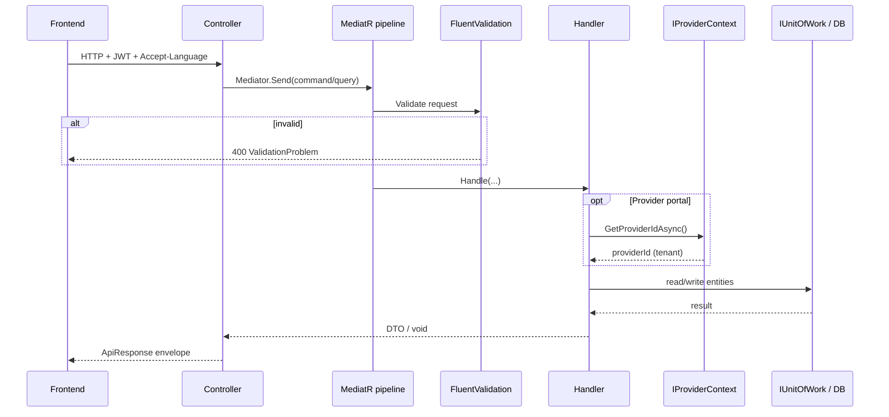
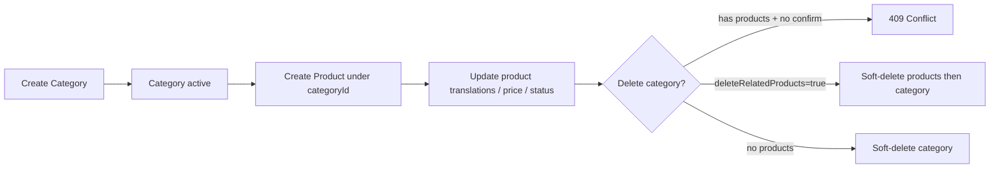

# Developer Workflow Guide (Junior / Fresh Engineers)

This guide explains **how this backend works**, how a request flows through the code, and what each portal (**Admin**, **Provider**, **Client**) can do.

Read this before changing features. Keep it next to [`ARCHITECTURE.md`](../ARCHITECTURE.md) and [`docs/AUTH_FLOW.md`](AUTH_FLOW.md).

---

## 1. Big picture (what is this system?)

This is a **marketplace-style API** with three portals (three types of users):

| Portal | Who | Main job |
|--------|-----|----------|
| **Admin** | Platform operators | Manage marketplace services, onboard providers, admin users/roles |
| **Provider** | Store / business owners + their staff | Manage **their own** catalog (categories, products), staff, roles |
| **Client** | End customers (shoppers) | Register / login / profile (catalog browsing for clients may grow later) |

Users are separated by `UserType`:

- `Client = 1`
- `Admin = 2`
- `Provider = 3`

A Provider user (or staff) is always scoped to **one store** (`ProviderId`). Admins are platform-wide. Clients are end-users.

---

## 2. Solution layers (Clean Architecture)

```text
HTTP request
    ↓
Enterprise.Api          → Controllers (thin), auth attributes, HTTP status codes
    ↓ MediatR
Enterprise.Application  → Commands/Queries + Handlers + Validators + DTOs
    ↓ interfaces
Enterprise.Domain       → Entities, enums, repository interfaces (no EF, no HTTP)
    ↑ implements
Enterprise.Infrastructure → EF Core, Identity, JWT, email/OTP, repositories
```

**Rules juniors must follow:**

1. Controllers **must stay thin** — bind request → `Mediator.Send(...)` → return `ApiResponse`.
2. Business rules live in **handlers** (and domain entities), not in controllers.
3. Domain entities must **not** reference Application or Infrastructure.
4. Use **permissions** from `Permissions.*` — never hardcode `"Some.Permission"` strings in new code.
5. User-facing messages use **resource keys** (`MessageKeys.*`), not English literals.

---

## 3. Request workflow (how code behaves)



### Step by step

1. **Controller** receives the HTTP call (`[RequireProvider]` / `[RequireAdmin]` / `[RequireClient]`).
2. **Authorization** checks JWT user type + permission claim (e.g. `ProviderProduct.Create`).
3. **MediatR** sends a Command (write) or Query (read).
4. **ValidationBehavior** runs FluentValidation (required fields, SKU format, localized text, etc.).
5. **Handler** runs business logic:
   - Resolves tenant via `IProviderContext` (Provider portal).
   - Loads entities through `IUnitOfWork` / repositories.
   - Applies domain methods (`UpdateDetails`, `SetStatus`, `ApplyLocalizedContent`, …).
   - Calls `SaveChangesAsync`.
6. **GlobalExceptionHandler** maps exceptions to HTTP:
   - `ValidationException` → 400
   - `NotFoundException` → 404
   - `ConflictException` → 409
   - `ForbiddenAccessException` → 403
   - unexpected → 500 (no stack traces to client)

### Soft delete behavior

Entities implementing `ISoftDelete` (Category, Product, …) are **not physically deleted** when handlers call `Remove(...)`.

An EF interceptor converts delete → update (`IsDeleted = true`, `DeletedAtUtc`, `DeletedBy`). Queries automatically filter out soft-deleted rows.

### Localization behavior

- Request language comes from `Accept-Language` (`en` / `it` / `ar`).
- Catalog entities store translations in child tables (`CategoryTranslations`, `ProductTranslations`).
- English (`en`) is required; Italian/Arabic are optional.
- `LocalizedContentHelper` upserts EN always; IT/AR only when provided (empty optional languages do **not** wipe existing translations).

---

## 4. Portal views

### 4.1 Admin portal (`/api/v1/admin/...`)

**Purpose:** operate the whole marketplace, not a single store.

| Area | Controllers (examples) | What Admin does |
|------|------------------------|-----------------|
| Auth | `AdminAuthController` | Login (email + password), refresh, forgot/reset password |
| Profile | `AdminProfileController` | View/update profile, change email/password |
| Providers | `AdminProvidersController` | Create/list/update/activate/delete marketplace **providers** (stores) |
| Services | `AdminServicesController` | CRUD **MarketplaceService** (Restaurant, Pharmacy, …) + translations |
| Admin users | `AdminUsersController` | Manage platform admin staff |
| Roles | `AdminRolesController` | Admin roles + permissions |
| Permissions | `AdminPermissionsController` | List admin permission catalog |

**Important:** Admin creates the **Provider account** and assigns a **MarketplaceService**. Provider then manages their own catalog.

```text
Admin creates MarketplaceService ("restaurant")
        ↓
Admin creates Provider linked to that service + owner user
        ↓
Provider logs into Provider portal and manages categories/products
```

---

### 4.2 Provider portal (`/api/v1/provider/...`)

**Purpose:** manage **one store** (tenant). Every catalog/staff/role action is scoped by `IProviderContext.GetProviderIdAsync()`.

| Area | Base route | What Provider does |
|------|------------|--------------------|
| Auth | `/provider/auth` | Login, refresh, forgot/reset password |
| Profile | `/provider/profile` | Owner/staff profile |
| Services | `/provider/services` | Read marketplace services (lookup) |
| Categories | `/provider/categories` | CRUD categories, set-active, delete |
| Products | `/provider/categories/{categoryId}/products` | CRUD products under a category |
| Staff | `/provider/staff` | Create/update/activate/delete store staff |
| Roles | `/provider/roles` | Store staff roles + permissions |
| Permissions | `/provider/permissions` | List provider permission catalog |

#### Catalog workflow (Categories → Products)



**Delete category rules (important):**

1. `DELETE /api/v1/provider/categories/{id}`  
   - If category has products → **409** with message that includes product count.  
   - Frontend should ask the user to confirm.
2. `DELETE /api/v1/provider/categories/{id}?deleteRelatedProducts=true`  
   - Soft-deletes related products, then soft-deletes the category.

**Product status enum:** `Draft = 0`, `Active = 1`, `Inactive = 2`.

**SKU uniqueness:** unique per **provider** (not global across all stores).

#### Who is “Provider” in JWT terms?

- Store **owner** (linked user on Provider entity).
- Store **staff** users with `provider_id` claim and assigned permissions.

Handlers must **not** trust a client-sent `providerId`. Always resolve via `IProviderContext`.

---

### 4.3 Client portal (`/api/v1/client/...`)

**Purpose:** end-customer authentication and profile.

| Area | Controllers | What Client does |
|------|-------------|------------------|
| Auth | `ClientAuthController` | Register (OTP), login (OTP / social), refresh, revoke |
| Profile | `ClientProfileController` | Get/update profile, change email |

Client auth is **OTP / social** oriented (see `docs/AUTH_FLOW.md`), not the same as Admin password login.

> Note: Provider catalog APIs today are for the **Provider portal**. Client-facing catalog/browse endpoints may be added later; do not expose Provider write APIs to Client tokens.

---

## 5. Feature folder pattern (where to put new code)

Prefer the **Categories / Staff style** (no redundant `Command`/`Query` suffix in folder names):

```text
Features/Provider/Products/
  Commands/CreateProduct/
    CreateProductCommand.cs
    CreateProductCommandHandler.cs
    CreateProductCommandValidator.cs
  Queries/GetProviderProductsList/
    GetProviderProductsListQuery.cs
    GetProviderProductsListQueryHandler.cs
  DTOs/
  ProductMapping.cs
```

**Checklist for a new Provider write feature:**

1. Permission in `PermissionCatalog` / `Permissions.*`
2. Command + Validator + Handler
3. Handler uses `IProviderContext` for tenant id
4. Controller: `[RequireProvider]` + `[RequirePermission(...)]`
5. Message keys in `MessageKeys` + `Messages.resx` / `.ar.resx` / `.it.resx`
6. Soft-delete friendly repository methods when deleting related data

---

## 6. Typical junior tasks mapped to files

| Task | Start here |
|------|------------|
| Add field to Product | Domain `Product.cs` → EF `ProductConfiguration` → migration → DTO → mapping → validator |
| New Provider API endpoint | Controller under `Controllers/V1/Provider` → Command/Query feature folder |
| Fix “wrong store data leaking” | Check `IProviderContext` + repository filters on `ProviderId` |
| Change delete-category confirm text | `MessageKeys.Category.HasLinkedProducts` + resx files |
| Validation message wrong language | `Messages.*.resx` + `Accept-Language` header |
| 409 vs 404 confusion | `ConflictException` (business conflict) vs `NotFoundException` (missing entity) |

---

## 7. Mental model: who owns what data?

```text
MarketplaceService (Admin)
        ↑ assigned to
     Provider (store)  ←── Admin creates
        │
        ├── Categories (Provider owns)
        │       └── Products (Provider owns via Category; FK CategoryId)
        ├── Staff users (Provider owns)
        └── Roles / permissions (Provider owns)

Client users are separate (not under a Provider tenant today for catalog writes).
```

---

## 8. Entity images (Azure Blob)

One optional image per **Category**, **Product**, **MarketplaceService**, and **Provider** (store logo). Stored as `ImageUrl` on the entity; files live in Azure Blob Storage.

### Config (`BlobStorage` in `appsettings.json`)

| Setting | Purpose |
|---------|---------|
| `ConnectionString` | Azure Storage connection string |
| `ContainerName` | Blob container (default `media`) |
| `PublicBaseUrl` | Public base URL used when building `ImageUrl` |

Without a connection string, image upload handlers fail when resolved — other APIs still work.

### Upload rules

- Multipart field name: `file`
- Allowed types: `image/jpeg`, `image/png`, `image/webp`
- Max size: **2 MB**
- Create/update JSON endpoints stay unchanged; upload **after** the entity exists

### Endpoints

| Portal | Method | Path |
|--------|--------|------|
| Provider | `POST` / `DELETE` | `/api/v1/provider/categories/{id}/image` |
| Provider | `POST` / `DELETE` | `/api/v1/provider/categories/{categoryId}/products/{id}/image` |
| Provider | `POST` / `DELETE` | `/api/v1/provider/profile/image` (current store logo) |
| Admin | `POST` / `DELETE` | `/api/v1/admin/services/{id}/image` |
| Admin | `POST` / `DELETE` | `/api/v1/admin/providers/{id}/image` |

Permissions: `ProviderCategory.Update` / `ProviderProduct.Update` for catalog; profile image only needs `[RequireProvider]`; admin uses `Services.Update` / `Providers.Update`.

Blob paths follow `providers/{providerId}/...` or `services/{serviceId}/...`. Replacing an image uploads the new blob, then best-effort deletes the previous one.

---

## 9. Logging (Application Insights)

Serilog writes to console, App Service files (`site/wwwroot/logs` via Kudu Advanced Tools), and — when configured — **Application Insights** (uploaded / searchable in Azure Portal).

### Azure App Service setting

| Name | Value |
|------|-------|
| `ApplicationInsights__ConnectionString` | Connection string from your Application Insights resource |

Leave `ApplicationInsights:ConnectionString` empty in repo / local if you do not want cloud telemetry. Restart the App Service after setting the value.

### Query examples (Portal → Application Insights → Logs)

```kusto
traces
| where timestamp > ago(1h)
| where message contains "Fetched category"
| project timestamp, severityLevel, message, customDimensions
```

```kusto
traces
| where customDimensions.CorrelationId == "<your-x-correlation-id>"
| order by timestamp asc
```

---

## 10. Local run tips

```bash
dotnet restore
dotnet run --project src/Enterprise.Api
```

- Swagger: use portal login → copy JWT → Authorize.
- Send `Accept-Language: ar` (or `en` / `it`) to test messages/translations.
- Dev admin seed (from README): `admin@enterprise.local` / `Admin@12345!`
- OTP codes often appear in logs if SMTP is not configured.

---

## 11. Do / Don’t

**Do**

- Keep controllers thin
- Use `IProviderContext` in Provider handlers
- Use `Permissions.*` constants
- Soft-delete related data intentionally (with confirm flags when destructive)
- Add validators with FluentValidation

**Don’t**

- Put SQL/EF `DbContext` in Application handlers (use repositories / UoW)
- Trust `providerId` from request body
- Return raw exceptions or stack traces
- Physically delete soft-delete entities unless there is a clear purge/admin policy
- Copy-paste `ResolveProviderIdAsync` into new handlers (use `IProviderContext`)

---

## 12. Related docs

- [`README.md`](../README.md) — how to run
- [`docs/AUTH_FLOW.md`](AUTH_FLOW.md) — auth endpoints
- [`docs/AUTH_STEP_BY_STEP.md`](AUTH_STEP_BY_STEP.md) — try auth locally
- [`ARCHITECTURE.md`](../ARCHITECTURE.md) — deeper architecture notes
