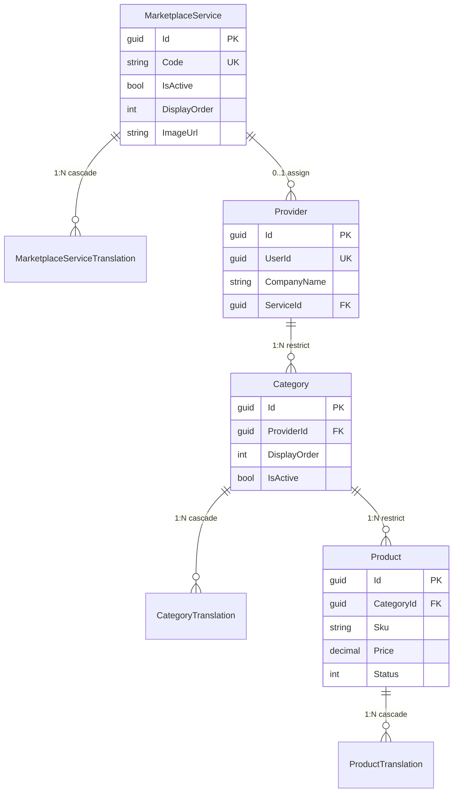
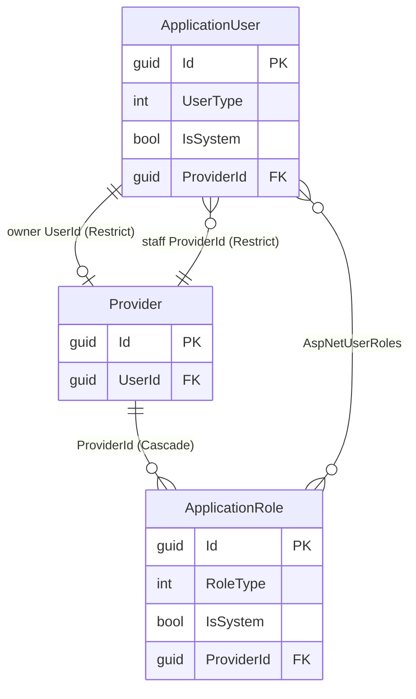
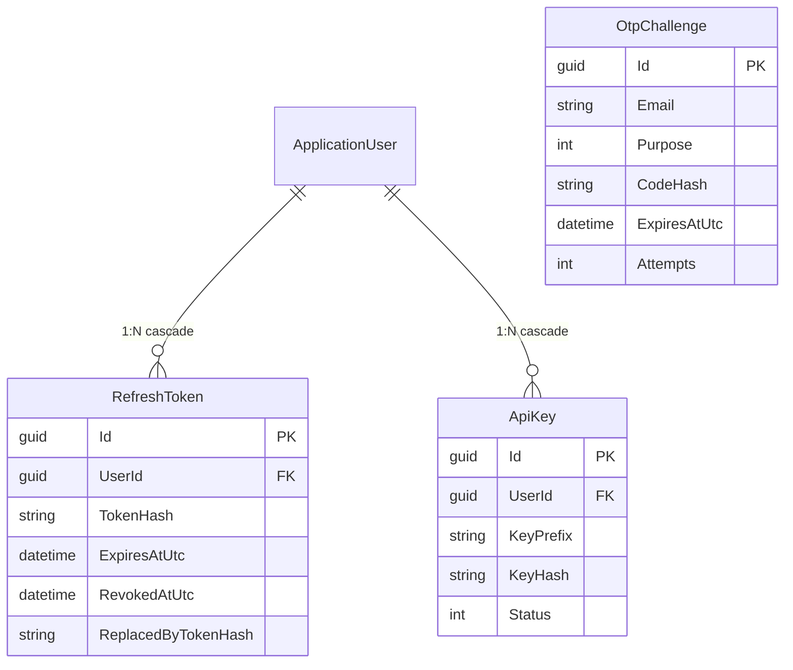

# Entity Relationship Diagram (ERD)

Software architecture view of the **Enterprise / Subito marketplace** persistence model, derived from `Enterprise.Domain` entities, ASP.NET Core Identity extensions, and EF Core configurations in `ApplicationDbContext`.

---

## 1. Architectural overview

The data model supports three portals (`UserType`):

| Portal | `UserType` | Scope |
|--------|------------|--------|
| Client | `1` | End customers |
| Admin | `2` | Platform-wide |
| Provider | `3` | Single store (`ProviderId`) |

**Core business chain:**

```text
MarketplaceService (platform catalog type)
        │ 0..1
        ▼
    Provider (store) ──1:1── ApplicationUser (owner)
        │
        ├── Categories (provider catalog)
        │         │
        │         └── Products (SKU + price)
        │
        ├── ApplicationUser (staff, optional ProviderId)
        └── ApplicationRole (provider-scoped roles)
```

**Cross-cutting patterns:**

- **Guid PKs** via `BaseEntity` / Identity `Guid` keys
- **Audit columns** on `BaseAuditableEntity` (`CreatedAtUtc`, `CreatedBy`, `LastModifiedAtUtc`, `LastModifiedBy`)
- **Soft delete** (`ISoftDelete`) on Provider, MarketplaceService, Category, Product — global EF query filter
- **i18n** via translation tables with composite PK `(ParentId, LanguageCode)` — languages: `en`, `ar`, `it`

---

## 2. Full ERD (Mermaid)

```mermaid
erDiagram
    %% ── Identity ──────────────────────────────────────────
    ApplicationUser ||--o| Provider : "owns (UserId)"
    Provider ||--o{ ApplicationUser : "staff (ProviderId)"
    Provider ||--o{ ApplicationRole : "scoped roles"
    ApplicationUser ||--o{ ApplicationUserRole : "has"
    ApplicationRole ||--o{ ApplicationUserRole : "assigned"
    ApplicationUser ||--o{ ApplicationUserClaim : "claims"
    ApplicationUser ||--o{ ApplicationUserLogin : "logins"
    ApplicationUser ||--o{ ApplicationUserToken : "tokens"
    ApplicationRole ||--o{ ApplicationRoleClaim : "claims"

    ApplicationUser ||--o{ RefreshToken : "sessions"
    ApplicationUser ||--o{ ApiKey : "credentials"

    %% ── Marketplace catalog ───────────────────────────────
    MarketplaceService ||--o{ MarketplaceServiceTranslation : "localized"
    MarketplaceService ||--o{ Provider : "ServiceId (optional)"

    Provider ||--o{ Category : "owns"
    Category ||--o{ CategoryTranslation : "localized"
    Category ||--o{ Product : "contains"
    Product ||--o{ ProductTranslation : "localized"
    %% ── Standalone ────────────────────────────────────────
    OtpChallenge

    ApplicationUser {
        guid Id PK
        string UserName
        string Email
        string PasswordHash
        string FirstName
        string LastName
        int UserType "Client|Admin|Provider"
        bool IsActive
        bool IsSystem
        guid ProviderId FK "nullable — staff"
        string PhoneNumber
        bool EmailConfirmed
        bool LockoutEnabled
        datetimeOffset LockoutEnd
    }

    ApplicationRole {
        guid Id PK
        string Name
        string NormalizedName
        bool IsSystem
        int RoleType "UserType"
        guid ProviderId FK "nullable — provider roles"
    }

    ApplicationUserRole {
        guid UserId PK_FK
        guid RoleId PK_FK
    }

    ApplicationUserClaim {
        int Id PK
        guid UserId FK
        string ClaimType
        string ClaimValue
    }

    ApplicationRoleClaim {
        int Id PK
        guid RoleId FK
        string ClaimType
        string ClaimValue
    }

    ApplicationUserLogin {
        string LoginProvider PK
        string ProviderKey PK
        guid UserId FK
    }

    ApplicationUserToken {
        guid UserId PK_FK
        string LoginProvider PK
        string Name PK
        string Value
    }

    Provider {
        guid Id PK
        guid UserId FK "unique when not deleted"
        string CompanyName
        string PhoneNumber
        string ImageUrl
        guid ServiceId FK "nullable"
        bool IsDeleted
        datetime DeletedAtUtc
        string DeletedBy
        datetime CreatedAtUtc
        string CreatedBy
        datetime LastModifiedAtUtc
        string LastModifiedBy
    }

    MarketplaceService {
        guid Id PK
        string Code UK "unique when not deleted"
        bool IsActive
        int DisplayOrder
        string ImageUrl
        bool IsDeleted
        datetime DeletedAtUtc
        string DeletedBy
        datetime CreatedAtUtc
        string CreatedBy
        datetime LastModifiedAtUtc
        string LastModifiedBy
    }

    MarketplaceServiceTranslation {
        guid MarketplaceServiceId PK_FK
        string LanguageCode PK "en|ar|it"
        string Name
        string Description
    }

    Category {
        guid Id PK
        guid ProviderId FK
        int DisplayOrder
        bool IsActive
        string ImageUrl
        bool IsDeleted
        datetime DeletedAtUtc
        string DeletedBy
        datetime CreatedAtUtc
        string CreatedBy
        datetime LastModifiedAtUtc
        string LastModifiedBy
    }

    CategoryTranslation {
        guid CategoryId PK_FK
        string LanguageCode PK
        string Name
        string Description
    }

    Product {
        guid Id PK
        guid CategoryId FK
        string Sku "unique per Category when not deleted"
        decimal Price
        int Status "Draft|Active|Inactive"
        string ImageUrl
        bool IsDeleted
        datetime DeletedAtUtc
        string DeletedBy
        datetime CreatedAtUtc
        string CreatedBy
        datetime LastModifiedAtUtc
        string LastModifiedBy
    }

    ProductTranslation {
        guid ProductId PK_FK
        string LanguageCode PK
        string Name
        string Description
    }

    RefreshToken {
        guid Id PK
        guid UserId FK
        string TokenHash
        datetime CreatedAtUtc
        datetime ExpiresAtUtc
        string CreatedByIp
        datetime RevokedAtUtc
        string RevokedByIp
        string ReplacedByTokenHash
        string ReasonRevoked
    }

    ApiKey {
        guid Id PK
        guid UserId FK
        string Name
        string KeyPrefix
        string KeyHash
        datetime ExpiresAtUtc
        datetime LastUsedAtUtc
        int Status "Active|Revoked|Expired"
        datetime CreatedAtUtc
        string CreatedBy
        datetime LastModifiedAtUtc
        string LastModifiedBy
    }

    OtpChallenge {
        guid Id PK
        string Email
        int Purpose "Register|Login|ChangeEmail|ResetPassword"
        string CodeHash
        datetime CreatedAtUtc
        datetime ExpiresAtUtc
        int Attempts
        datetime ConsumedAtUtc
    }
```

---

## 3. Domain subdomains

### 3.1 Marketplace catalog



| Relationship | Cardinality | Delete behavior | Notes |
|--------------|-------------|-----------------|-------|
| `MarketplaceService` → `MarketplaceServiceTranslation` | 1 : N | Cascade | Composite PK `(MarketplaceServiceId, LanguageCode)` |
| `MarketplaceService` → `Provider` | 1 : 0..N | Restrict | Optional `ServiceId` on Provider |
| `Provider` → `Category` | 1 : N | Restrict | Soft-deleted parents still block hard delete |
| `Category` → `CategoryTranslation` | 1 : N | Cascade | Composite PK `(CategoryId, LanguageCode)` |
| `Category` → `Product` | 1 : N | Restrict | Provider scope via Category |
| `Product` → `ProductTranslation` | 1 : N | Cascade | Composite PK `(ProductId, LanguageCode)` |

**Business rules encoded in the schema:**

- One active (non-deleted) Provider per `UserId`
- Unique `MarketplaceService.Code` among non-deleted rows
- Unique `(CategoryId, Sku)` among non-deleted Products
- Provider-wide SKU uniqueness enforced in application code via `Category.ProviderId`

---

### 3.2 Identity, staff, and roles



| Relationship | Cardinality | Delete behavior | Notes |
|--------------|-------------|-----------------|-------|
| `ApplicationUser` → `Provider` (owner) | 1 : 0..1 | Restrict | `Provider.UserId` → user; unique filtered index |
| `Provider` → `ApplicationUser` (staff) | 1 : 0..N | Restrict | `ApplicationUser.ProviderId` for staff accounts |
| `Provider` → `ApplicationRole` | 1 : 0..N | Cascade | Provider-scoped custom roles |
| User ↔ Role | M : N | Identity default | `AspNetUserRoles` |

**Ownership vs staffing:**

- **Owner link:** `Provider.UserId` → the Identity user that owns the store (typically `UserType.Provider`)
- **Staff link:** `ApplicationUser.ProviderId` → staff members belonging to that store
- Platform admin roles have `ProviderId = null` and `RoleType = Admin`

Permissions are stored as **role claims** (`AspNetRoleClaims`) using the application permission catalog (not separate domain tables).

---

### 3.3 Authentication & credentials



| Entity | Purpose | Security notes |
|--------|---------|----------------|
| `RefreshToken` | JWT refresh / rotation | Only SHA-256 hash stored; reuse detection via `ReplacedByTokenHash` |
| `ApiKey` | Service-to-service auth | Only hash + prefix stored; never raw secret |
| `OtpChallenge` | Email OTP flows | Hash only; indexed by `(Email, Purpose)`; no FK to User (pre-registration) |

---

## 4. Enumerations

| Enum | Values | Used by |
|------|--------|---------|
| `UserType` | `Client=1`, `Admin=2`, `Provider=3` | `ApplicationUser`, `ApplicationRole.RoleType` |
| `ProductStatus` | `Draft=0`, `Active=1`, `Inactive=2` | `Product.Status` |
| `ApiKeyStatus` | `Active=0`, `Revoked=1`, `Expired=2` | `ApiKey.Status` |
| `OtpPurpose` | `Register=1`, `Login=2`, `ChangeEmail=3`, `ResetPassword=4` | `OtpChallenge.Purpose` |

---

## 5. Table inventory

### Domain / business

| Table | Entity | Soft delete | Auditable |
|-------|--------|-------------|-----------|
| `Providers` | `Provider` | Yes | Yes |
| `MarketplaceServices` | `MarketplaceService` | Yes | Yes |
| `MarketplaceServiceTranslations` | `MarketplaceServiceTranslation` | No | No |
| `Categories` | `Category` | Yes | Yes |
| `CategoryTranslations` | `CategoryTranslation` | No | No |
| `Products` | `Product` | Yes | Yes |
| `ProductTranslations` | `ProductTranslation` | No | No |
| `RefreshTokens` | `RefreshToken` | No | No (has `CreatedAtUtc` only) |
| `ApiKeys` | `ApiKey` | No | Yes |
| `OtpChallenges` | `OtpChallenge` | No | No |

### ASP.NET Core Identity (extended)

| Table | Entity / type |
|-------|----------------|
| `AspNetUsers` | `ApplicationUser` |
| `AspNetRoles` | `ApplicationRole` |
| `AspNetUserRoles` | `IdentityUserRole<Guid>` |
| `AspNetUserClaims` | `IdentityUserClaim<Guid>` |
| `AspNetRoleClaims` | `IdentityRoleClaim<Guid>` |
| `AspNetUserLogins` | `IdentityUserLogin<Guid>` |
| `AspNetUserTokens` | `IdentityUserToken<Guid>` |

---

## 6. Key constraints & indexes (notable)

| Object | Constraint / index |
|--------|--------------------|
| `Providers.UserId` | Unique filtered: `[IsDeleted] = 0` |
| `Providers.ServiceId` | Index |
| `MarketplaceServices.Code` | Unique filtered: `[IsDeleted] = 0` |
| `Products (CategoryId, Sku)` | Unique filtered: `[IsDeleted] = 0` |
| `ApplicationRole (RoleType, ProviderId)` | Index |
| `ApplicationUser.ProviderId` | Index |
| `OtpChallenges (Email, Purpose)` | Index |
| Translation tables | PK `(ParentId, LanguageCode)` |

---

## 7. Source of truth

| Concern | Location |
|---------|----------|
| Domain entities | `src/Enterprise.Domain/Entities/` |
| Identity types | `src/Enterprise.Infrastructure/Identity/` |
| EF mappings | `src/Enterprise.Infrastructure/Persistence/Configurations/` |
| Relationship wiring | `src/Enterprise.Infrastructure/Persistence/ApplicationDbContext.cs` |
| Schema snapshot | `src/Enterprise.Infrastructure/Persistence/Migrations/ApplicationDbContextModelSnapshot.cs` |

---

*Generated as an architecture artifact from the current codebase. Update this document when aggregates or foreign keys change.*
