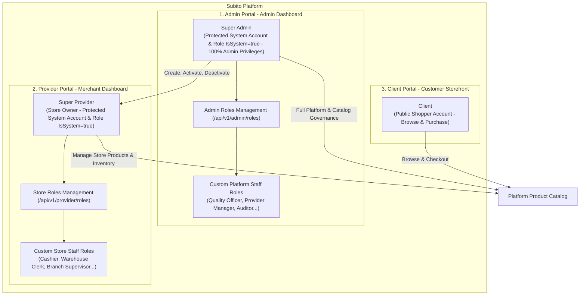

# Subito Platform Roles & Permissions Guide

The **Subito** platform (a Multi-Vendor Marketplace inspired by Noon, Talabat, and InstaShop) is built on a flexible, fine-grained, and robust authorization architecture. It strictly isolates **Portals**, distinguishes between undeletable **System Super Principals (`IsSystem = true`)** and store/platform **Custom Staff Roles (`IsSystem = false`)**, and incrementally expands permissions module-by-module via an automated seeding engine.

---

## 1. High-Level Architecture & Portals



---

## 2. Protected System Principals (Super Entities)

These principals represent permanent, non-deletable system identities (`IsSystem = true`):

### A) Super Admin (Platform Super Administrator):
* **Who are they?** The supreme administrative and operational authority across the entire Subito platform.
* **Privileges:** Has **all Admin Portal permissions (All Admin Permissions)** permanently and unconditionally (covering all current and future admin modules).
* **Automatic Synchronization:** On application startup, the `DbSeeder` examines `PermissionCatalog.cs` and automatically grants any newly registered admin permission to the `Admin` role.
* **Protection & Security:** Both the Super Admin user account and the `Admin` role are marked as **`IsSystem = true`**. Any deletion attempt (`DELETE`) is immediately blocked by the backend, returning HTTP `409 Conflict` with the localized message: `Role.CannotDeleteSystemUser` or `Role.CannotDeleteSystemRole`.

### B) Super Provider (Merchant / Store Owner):
* **Who are they?** The primary account holder and owner of a merchant store or seller business created by platform administration.
* **Privileges:** Holds **all Provider Portal permissions (All Provider Permissions)** to manage the store profile, branch staff, and product catalog.
* **Automatic Synchronization:** On startup, `DbSeeder` automatically synchronizes the `Provider` role with any newly registered provider permissions (e.g., when future provider modules such as order fulfillment and store inventory management are introduced).
* **Protection & Security:** Both the merchant account and the `Provider` role are marked as **`IsSystem = true`**. Store staff members cannot delete, deactivate, or modify the Super Provider identity.

### C) Client (End Shopper):
* Public shopper role with self-service registration, holding catalog read privileges (`Products.Read`) and guarded by the `[RequireClient]` policy.

---

## 3. Custom Staff Roles (Custom Roles)

These roles are dynamically created and configured by administrators in the Admin Dashboard or by store owners in their merchant dashboard via the **Roles Management API** (`IsSystem = false`):

| Custom Role Type | Created By | Permitted Scope | Real-World Examples |
| :--- | :--- | :--- | :--- |
| **Custom Admin Role** | Super Admin in Admin Dashboard | Subset of **Admin Portal** permissions | **Provider Operations Officer:** Has `Providers.Read` & `Providers.Update`<br>**Catalog Auditor:** Has `Products.Read` & `Products.Update` only |
| **Custom Provider Role** | Super Provider in Merchant Dashboard | Subset of **Provider Portal** permissions scoped to that specific store | **Store Cashier:** Can view catalog and process orders<br>**Warehouse Associate:** Can adjust stock levels only |

### Multi-Tenant Store Scoping & Isolation
* Every custom role created by a merchant is automatically bound to that merchant's store ID (`AspNetRoles.ProviderId = currentProvider.Id`).
* Store A cannot inspect, modify, or delete custom roles belonging to Store B.
* Store staff can never view, select, or assign any permission originating from the Admin Portal catalog.

---

## 4. Modular Permissions Principle

Permissions are not defined arbitrarily or hard-coded into single lists. Instead, they **scale incrementally alongside each new domain module in the project**:

1. A central catalog exists in code (`PermissionCatalog.cs`) mapping every permission to its target **Portal** (`UserType.Admin` vs `UserType.Provider`), **Module**, and **Action**.
2. **When adding an Admin Module:**
   * Define standard action verbs: `Read`, `Create`, `Update`, `Delete`.
   * *Example - Provider Management Module:*  
     `Providers.Read` | `Providers.Create` | `Providers.Update` | `Providers.Delete`
   * *Example - Admin Roles Management Module:*  
     `Roles.Read` | `Roles.Create` | `Roles.Update` | `Roles.Delete`
3. **When adding a Provider Module:**
   * Define permissions belonging to the merchant portal:
   * *Example - Store Roles Management Module:*  
     `ProviderRoles.Read` | `ProviderRoles.Create` | `ProviderRoles.Update` | `ProviderRoles.Delete`
   * *Example - Catalog Exploration Module:*  
     `Products.Read`
4. **Automated Seeder Synchronization:**
   * Whenever new modules and permissions are added to `PermissionCatalog.cs`, the startup `DbSeeder`:
     * Automatically assigns all Admin permissions to **Super Admin**.
     * Automatically assigns all Provider permissions to **Super Provider**.

---

## 5. API Endpoints Specification

Role and permission governance is partitioned into two dedicated controller surfaces:

---

### I. Admin Dashboard (`/api/v1/admin`)

#### 1. Admin Permissions Checklist:
* **`GET /api/v1/admin/permissions`**  
  * **Authorization:** `[RequireAdmin]` + `[RequirePermission("Roles.Read")]`  
  * **Function:** Returns all Admin portal permissions grouped by module (`Providers`, `Roles`, `Products`, `ApiKeys`) for rendering checkbox trees in admin staff role creation/editing UI.

#### 2. Admin Roles CRUD:
| Method | Route | Required Permission | Responsibility |
| :--- | :--- | :--- | :--- |
| **GET** | `/api/v1/admin/roles` | `Roles.Read` | Paged list of administrative roles with search, user count per role, and assigned permissions. |
| **GET** | `/api/v1/admin/roles/{id}` | `Roles.Read` | Fetches details and assigned permission claims for a specific admin role. |
| **POST** | `/api/v1/admin/roles` | `Roles.Create` | Creates a new custom administrative role with designated admin permissions. |
| **PUT** | `/api/v1/admin/roles/{id}` | `Roles.Update` | Updates role name and synchronizes assigned permission claims (system roles are immutable). |
| **DELETE** | `/api/v1/admin/roles/{id}` | `Roles.Delete` | Deletes a custom admin role (deleting `IsSystem = true` roles is blocked). |

---

### II. Provider Dashboard (`/api/v1/provider`)

Managed exclusively from within the **Merchant Dashboard** for their respective store staff:

#### 1. Provider Permissions Checklist:
* **`GET /api/v1/provider/permissions`**  
  * **Authorization:** `[RequireProvider]` + `[RequirePermission("ProviderRoles.Read")]`  
  * **Function:** Returns all permissions available for the store portal (`ProviderRoles.*`, `Products.Read`, and upcoming store-level modules).

#### 2. Provider Roles CRUD:
| Method | Route | Required Permission | Responsibility |
| :--- | :--- | :--- | :--- |
| **GET** | `/api/v1/provider/roles` | `ProviderRoles.Read` | Paged list of roles belonging strictly to the caller's store (`ProviderId == currentProvider.Id`). |
| **GET** | `/api/v1/provider/roles/{id}` | `ProviderRoles.Read` | Fetches details and permissions for a store staff role belonging to the current merchant. |
| **POST** | `/api/v1/provider/roles` | `ProviderRoles.Create` | Creates a new store role (cashier, warehouse, supervisor) scoped to the current store. |
| **PUT** | `/api/v1/provider/roles/{id}` | `ProviderRoles.Update` | Updates the role name and permissions (Super Provider role cannot be altered). |
| **DELETE** | `/api/v1/provider/roles/{id}` | `ProviderRoles.Delete` | Deletes a custom store role (Super Provider system role cannot be deleted). |

---

## 6. Technical Enforcement & Security Mechanisms

1. **Storage Schema:**
   * Permissions are stored as claims inside `AspNetRoleClaims` (`ClaimType = "permission"`).
   * Roles contain `IsSystem`, `RoleType`, and nullable `ProviderId` foreign key to `Providers`.
   * Users contain `IsSystem` to safeguard root accounts.
2. **JWT Claims Flattening:**
   * Upon authentication, the identity service resolves all assigned roles, extracts their associated permission claims, flattens them into a unique set, and embeds them directly into the JWT `permission` array.
3. **Dual-Layer Endpoint Protection:**
   * Endpoints enforce two independent authorization gates:
     ```csharp
     [RequireAdmin] // 1. Validates the portal entry via user_type claim
     [RequirePermission("Roles.Create")] // 2. Validates that the caller holds the exact fine-grained permission
     ```
4. **System Protection Guards (`IsSystem`):**
   * Handlers verify `IsSystem` before processing update or delete actions.
   * If `IsSystem == true`, the mutation is rejected with `ConflictException` and HTTP status `409 Conflict`.
